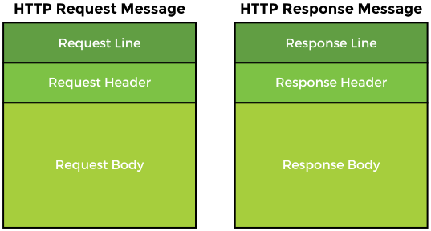
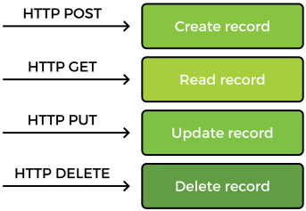
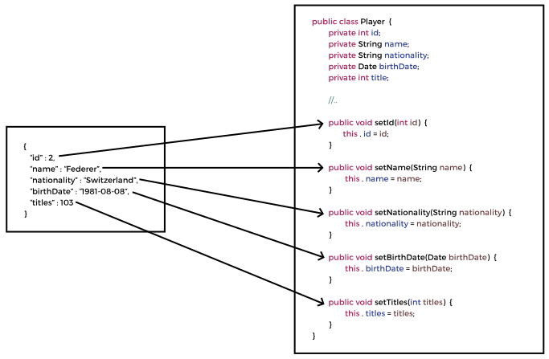
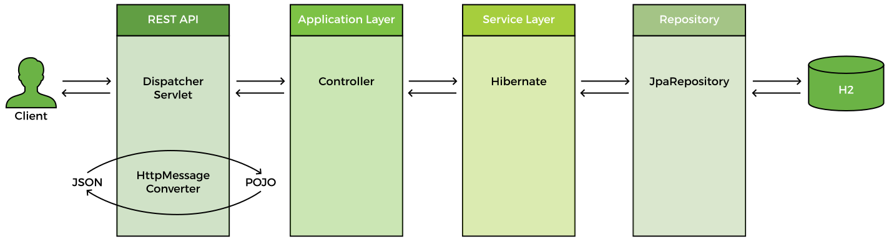

# What is REST?

REST stands for the **RE**presentational **S**tate **T**ransfer. 
It provides a mechanism for communication between applications. 
In the REST architecture, the client and server are implemented independently and they do not depend on one another. 
REST is language independent, so the client and server applications can use different programming languages. 
This gives REST applications a lot of flexibility.


The REST architecture is stateless meaning that the client only manages session state and the server only manages the resource state. 
The communication between the client and server is such that every request contains all the information necessary to interpret it without any previous context.

Both the client and server know the communication format and are able to understand the message sent by the other side. 
REST calls can be made over HTTP. The client can send HTTP request message to the server where it is processed and an HTTP response is sent back.



The request message has three parts:

1. The request line contains the HTTP method like (GET or POST etc.)
2. The request header contains data with additional information about the request.
3. The request body contains the contents of the message, e.g., if it is a POST request, the request body will contain the contents of the entity to be created.

The response message also has three parts:

1. The response line contains the status code for success or redirection etc.
2. The response header contains additional information about the response like the content type and the size of the response. The client can render the data based on the content type so if it is text/html, it is displayed according to the HTML tags and if it is application/json or application/xml, it is processed accordingly.
3. The response body contains the actual message sent in response to the request.

The HTTP methods for CRUD operations are:

1. POST for creating a resource
2. GET for reading a resource
3. PUT for updating a resource
4. DELETE for deleting a resource



# JSON Data Binding

The most commonly used data formats in a REST application are JSON and XML. JSON stands for **J**ava**S**cript **O**bject **N**otation. It is a plain text data format used for exchanging data between applications.

JSON is a collection of name-value pairs, which the application processes as a string. So, instead of using HTML or JSP to send data, it is passed as a String and the application can process and render the data accordingly. JSON is language independent and can be used with any programming language.

## Syntax

```json
{
    "id": "1",
    "fname": "Sara",
    "lname": "Adams",
    "hobbies": [
        "singing",
        "painting"
    ],
    "address": {
        "city": "Adelaide",
        "country": "Australia"
    }
}
```

- A JSON object is defined between curly braces (`{ }`).
- The object consists of members in the form of comma separated name-value pairs.
- The names and values are separated by colon (`:`).
- Names are provided in double quotes and are on the left side of the colon.
- The values are on the right side of the colon.
- If the value is a string, it is written in double quotes.
- JSON also supports arrays written within square brackets (`[ ]`) that contains a comma separated list of values.
- An object can contain nested objects.
- JSON objects can have `null` value.
- Boolean values true and `false` are also allowed.

## Java - JSON data binding


A Java object (POJO) can be converted into a JSON object and vice versa through a process called data binding. We can read JSON and use it to populate a Java object. In the same manner, we can use a Java object to create JSON.

## Jackson Project

Jackson Project handles data binding between Java and JSON. It also provides support for data binding with XML. Spring framework uses the Jackson project for data binding. The Jackson data binding API is present in the `com.fasterxml.jackson.databind` package.

The following maven dependency adds Jackson support to the project:

```xml
<dependency>
    <groupId>com.fasterxml.jackson.core</groupId>
    <artifactId>jackson-databind</artifactId>
    <version>{version}</version>
</dependency>
```

Jackson handles the conversion between JSON and POJOs by making use of the getter and setter methods of a class. To convert a JSON object to POJO, the setter methods are called. Vice versa, to create a JSON object from a POJO, the getters methods are used. Jackson has access to the getters and setters only, not the private fields of the class.

The figure below illustrates how Jackson converts JSON data to a Java object. It calls the corresponding setter methods to populate the class members. If a setter method matching a JSON property is not found, an exception is thrown.


Creating a POJO from JSON

The Jackson annotation ``@JsonIgnoreProperties`` can be used to bypass the exception by setting the `IgnoreUnknown` attribute to `true`. This feature is useful when the JSON file contains more properties but we are only interested in a few of them.

---

## `@RestController`
This annotation is an extension of `@Controller` annotation. The `@RestController` annotation has support for REST requests and responses and automatically handles the data binding between the Java POJOs and JSON.

### `@RestController` vs `@Controller`

In Spring MVC and Spring Boot, `@Controller` and `@RestController` are two annotations used to define the behavior of classes that handle web requests. Both annotations are used to mark a class as a web controller, but they have different purposes and use cases:

1. `@Controller`:

    - `@Controller` is a traditional Spring MVC annotation used to mark a class as a web controller.
    - When using `@Controller`, you typically return a view name (e.g., the name of a Thymeleaf, JSP, or other template) from your methods, and the Spring MVC framework resolves the view and renders the HTML content.
    - To return a JSON or other non-HTML response from a method in a `@Controller` class, you need to use the `@ResponseBody` annotation on that method. This tells Spring MVC to skip the view resolution and directly write the returned object as the HTTP response body after converting it to the appropriate format (e.g., JSON).

2. `@RestController`:

    - `@RestController` is a more recent annotation introduced in Spring 4 and is a convenient alternative to `@Controller` when building RESTful APIs.
    - It is a combination of `@Controller` and `@ResponseBody`. When you use `@RestController`, all methods in the class are treated as if they have the `@ResponseBody` annotation applied, which means they will return data directly as the HTTP response body.
    - `@RestController` is used when you want to return JSON, XML, or other non-HTML responses from your controller methods, which is common when building RESTful APIs.

## `@GetMapping`

The client sends an HTTP request to the REST service. The **dispatcher servlet** handles the request and if the request has JSON data, the `HttpMessageConverter` converts it to Java objects. The request is mapped to a controller which calls service layer methods. The service layer delegates the call to repository and returns the data as POJO. The `MessageConverter` converts the data to JSON and it is sent back to the client. The flow of request is shown below:



## `@PathVariable`

Path variables are a way of parameterizing the path or endpoint to accept data. Path variables are written in curly braces. When the client sends a request, it passes a value in place of the path variable.

`@PathVariable` is an annotation in Spring MVC and Spring Boot that allows you to extract values from the URI path of an incoming HTTP request and bind them to method parameters in your controller. This is a common technique used in RESTful APIs, where the path of a resource is used to convey information about the requested resource.

Here's an example of how to use `@PathVariable`:

1. Create a simple `Book` class:

```Java
public class Book {
    private long id;
    private String title;
    private String author;

    public Book(long id, String title, String author) {
        this.id = id;
        this.title = title;
        this.author = author;
    }

    // Getters and setters
    // ...
}
```

2. Create a `BookController` class and use `@PathVariable` to extract the `id` value from the request URI:

```Java
import org.springframework.web.bind.annotation.GetMapping;
import org.springframework.web.bind.annotation.PathVariable;
import org.springframework.web.bind.annotation.RestController;

@RestController
public class BookController {

    @GetMapping("/books/{id}")
    public Book getBookById(@PathVariable("id") long id) {
        // For simplicity, we return a dummy book based on the id
        return new Book(id, "Example Book Title", "Example Author");
    }
}
```

In this example, the `BookController` class is annotated with `@RestController`, indicating that it's a RESTful API controller. The `getBookById()` method is responsible for handling the `/books/{id}` endpoint, where `{id}` is a placeholder for the book's ID. The `@PathVariable("id")` annotation is used to bind the value of the `id` path variable to the `id` parameter of the method.

Now, when you run the application and make a GET request to a URI like `/books/42`, the server will extract the value 42 from the path and pass it to the `getBookById()` method. The method will then return a `Book` object with the specified ID:

```json
{
  "id": 42,
  "title": "Example Book Title",
  "author": "Example Author"
}
```

Using `@PathVariable` makes it easy to create flexible, self-descriptive APIs that follow the principles of REST.

## `@PostMapping`

`@PostMapping` is an annotation in Spring MVC and Spring Boot used to handle HTTP POST requests. It's a shorthand for `@RequestMapping(method = RequestMethod.POST)`. You can use `@PostMapping` to create an endpoint in your controller that accepts POST requests and processes the incoming data.

## `save` method

The `JpaRepository` interface inherits a method from the `CrudRepository` called `save`. This method handles both inserts and updates. To distinguish between an ***INSERT*** and ***UPDATE*** operation, the `save` method checks the primary key of the object that is being passed to it. If the primary key is **empty** or `null`, an ***INSERT*** operation is performed, otherwise an ***UPDATE*** to an existing record is performed.

## `@RequestBody`

`@RequestBody` is an annotation in Spring MVC and Spring Boot that is used to bind the body of an incoming HTTP request to a method parameter in your controller. It is typically used in combination with `@PostMapping`, `@PutMapping`, or other HTTP request mapping annotations to handle requests that contain a payload, such as JSON or XML data.

When a request with a payload is received, Spring uses an appropriate `HttpMessageConverter` to convert the payload data into a Java object based on the content type of the request (e.g., `application/json` or `application/xml`). The `@RequestBody` annotation tells Spring to bind the deserialized object to the annotated method parameter.

## How data gets mapped to java object from http request?

When an HTTP request is received by a Spring Boot application, the request data is mapped to a Java object using `HttpMessageConverter` instances. These converters are responsible for converting the request body data (e.g., JSON or XML) to a Java object and vice versa. Spring Boot automatically configures a set of default converters based on the libraries available in the classpath.

Here's an overview of how the data gets mapped from an HTTP request to a Java object in Spring Boot:

1. The application receives an HTTP request with a payload (e.g., JSON or XML).

2. The request is processed by the Spring Boot `DispatcherServlet`, which identifies the appropriate controller method to handle the request based on the request mapping annotations (`@GetMapping`, `@PostMapping`, etc.).

3. If the controller method has a parameter annotated with `@RequestBody`, Spring looks for a suitable `HttpMessageConverter` to convert the payload data into a Java object.

4. The `Content-Type` header in the HTTP request is used to determine the payload's format (e.g., `application/json` or `application/xml`). Spring then selects a matching `HttpMessageConverter` based on the content type.

5. The selected `HttpMessageConverter` reads the request body, deserializes the data, and creates a Java object. Some common converters used by Spring Boot include:

    1. `MappingJackson2HttpMessageConverter` for JSON, which uses the Jackson library for data binding.
    2. `Jaxb2RootElementHttpMessageConverter` for XML, which uses JAXB for data binding.

6. The Java object created by the `HttpMessageConverter` is then passed as an argument to the controller method.

The controller method processes the Java object and generates a response, which is then serialized back into the appropriate format (e.g., JSON or XML) using the corresponding `HttpMessageConverter` before being sent as the HTTP response.

In summary, the data mapping process in Spring Boot relies on `HttpMessageConverter` instances to convert the payload data between the HTTP request and Java objects. The selection of the appropriate converter is based on the request's Content-Type header and the availability of data binding libraries in the application's classpath.

## `@PutMapping`

`@PutMapping` is an annotation in the Spring Framework, specifically in Spring Web MVC, that is used to map HTTP PUT requests to specific handler methods in your controller classes. It is a composed annotation that acts as a shortcut for `@RequestMapping(method = RequestMethod.PUT)`.

The `@PutMapping` annotation is used to define a handler method for updating resources in RESTful web services. When you annotate a method with `@PutMapping`, Spring will route incoming HTTP PUT requests to that method, based on the specified URI pattern.